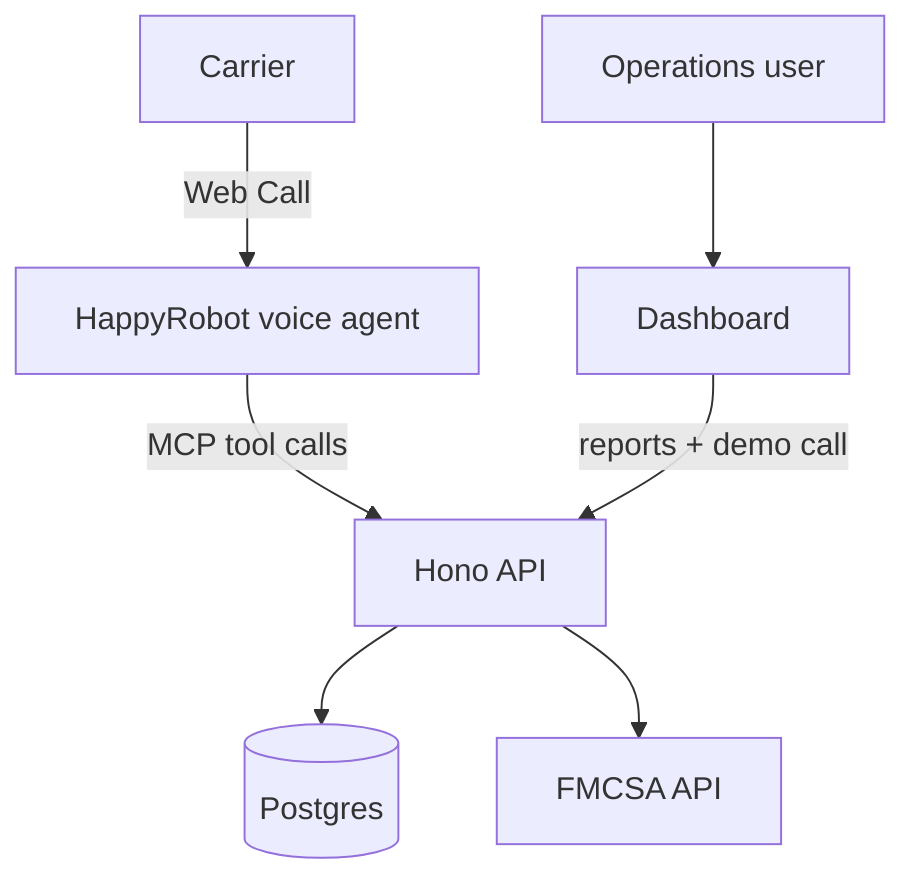
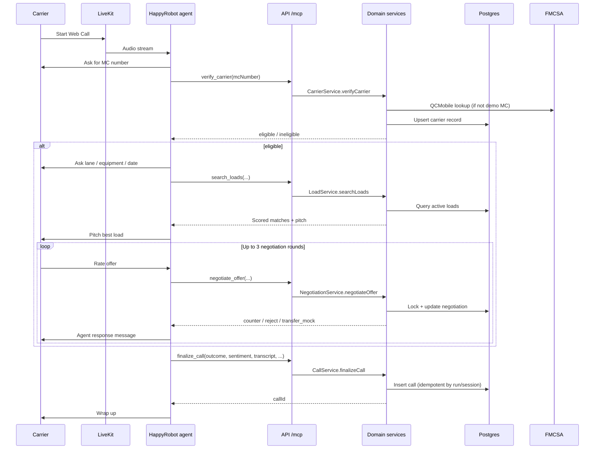
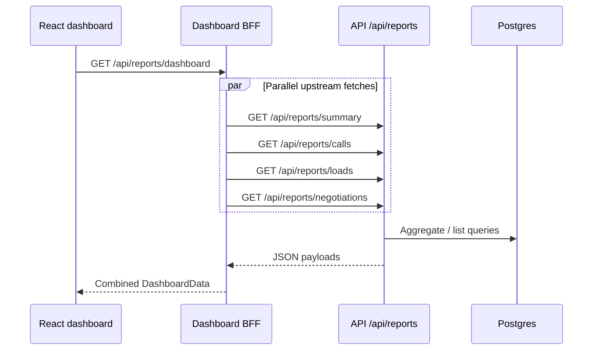

# System Architecture

This document describes how the HappyRobot inbound carrier sales proof of concept is structured, how its components interact, and where responsibilities live. For deployment steps see [railway-deployment.md](./railway-deployment.md). For security boundaries see [security-poc.md](./security-poc.md). For dashboard specifics see [dashboard.md](./dashboard.md).

## Purpose

The system automates inbound carrier load sales calls. HappyRobot runs the voice conversation; a custom backend owns freight operations logic (carrier vetting, load matching, rate negotiation, call finalization, and reporting). Postgres stores broker-owned operational data so reporting does not depend on HappyRobot platform analytics.

The POC targets **Web Call** demos (no PSTN phone number). A mock transfer message is returned when a rate is accepted, since Web Call cannot perform a real phone transfer.

## High-Level View



**Call path:** carrier talks to HappyRobot; the agent calls freight tools on the API over MCP.

**Dashboard path:** the browser hits the dashboard BFF, which proxies read-only report routes (and voice tokens for demos) to the API.

## Monorepo Layout

| Path | Role |
| --- | --- |
| `apps/api` | Hono API, Drizzle schema, domain services, MCP server, migrations, seed |
| `apps/web` | Operations dashboard (Vite + React) and production BFF |
| `packages/shared` | Shared Zod request/response schemas and TypeScript types |
| `scripts/happyrobot` | HappyRobot SDK workflow sync and session inspection |
| `infra/terraform` | Railway project provisioning (Postgres, API, dashboard, secrets) |
| `reference/` | HappyRobot SDK and Builder reference notes (not runtime code) |

The root `package.json` defines Bun workspaces and orchestration scripts (`dev`, `dev:up`, `happyrobot:sync`, `validate`, etc.).

## Runtime Components

### 1. HappyRobot inbound voice workflow

Configured via `scripts/happyrobot/sync-workflow.ts` and `scripts/happyrobot/workflow-spec.ts`. The sync script:

- Creates or updates an `inbound-voice-agent` workflow (default name: **Inbound Carrier Sales POC**).
- Registers the Hono MCP server URL with Bearer authentication in HappyRobot.
- Syncs workflow variables (API base URL, MCP URL).
- Publishes the workflow when `--publish` is passed.

At runtime the agent converses with the carrier, collects MC number and lane preferences, and invokes backend tools through the registered MCP integration during the call.

### 2. API service (`apps/api`)

Entry point: `apps/api/src/index.ts` loads config, connects to Postgres, wires services, and serves the Hono app from `apps/api/src/app.ts`.

**Route groups:**

| Prefix | Auth | Purpose |
| --- | --- | --- |
| `GET /health` | None | Liveness |
| `/api/*` | `X-API-Key` | REST tool endpoints, reporting, voice token |
| `/mcp/:token` | Bearer `MCP_AUTH_TOKEN` + path token | MCP Streamable HTTP transport for HappyRobot |

**Middleware stack:**

- Request tracing with `X-Request-ID` propagation and structured logs.
- CORS on `/api/*` for configured origins.
- API key validation on all `/api/*` routes.
- Centralized 404 and 500 handlers.

**Domain services** (`apps/api/src/services/`):

| Service | Responsibility |
| --- | --- |
| `carriers` | FMCSA lookup, seeded demo fallback, eligibility persistence |
| `loads` | Active load search with scoring and pitch strings |
| `negotiations` | Three-round rate policy with advisory locks |
| `calls` | Post-call persistence, idempotency by HappyRobot run/session |
| `reports` | Aggregations and list endpoints for the dashboard |
| `voice` | HappyRobot SDK client for Web Call token creation |

Services are composed in `createServices()` and injected into both REST and MCP handlers so both surfaces share identical business logic.

### 3. MCP server (`apps/api/src/mcp/`)

HappyRobot calls tools over MCP Streamable HTTP at:

```text
POST https://<api-host>/mcp/<MCP_PATH_TOKEN>
Authorization: Bearer <MCP_AUTH_TOKEN>
```

Implementation details:

- Uses `@modelcontextprotocol/server` with `WebStandardStreamableHTTPServerTransport`.
- Exposes four tools mirroring the REST tool routes: `verify_carrier`, `search_loads`, `negotiate_offer`, `finalize_call`.
- Tool input schemas are generated from the same Zod definitions in `packages/shared`.
- `callMcpTool()` normalizes LLM-shaped arguments (string numbers, template placeholders, MC extraction from `_message`) before Zod parsing.

Wrong path tokens return **404** (not found). Invalid Bearer tokens return **401**.

### 4. Postgres

Schema: `apps/api/src/db/schema.ts`. Migrations: `apps/api/drizzle/`. Seed data: loaded on deploy and via `bun run db:seed`.

**Tables:**

| Table | Stores |
| --- | --- |
| `loads` | Active freight inventory, rate bands (`loadboard_rate`, `target_rate`, `max_auto_rate`) |
| `carriers` | Verification results (FMCSA or seed), eligibility flags |
| `negotiations` | Per-session/load negotiation state, offer history (JSONB) |
| `calls` | Finalized call records linked to negotiations, loads, carriers |

Drizzle relations connect calls → negotiations → loads/carriers for reporting joins.

### 5. Operations dashboard (`apps/web`)

A Vite + React SPA for broker operations and prospect demos. It does **not** configure HappyRobot workflows.

**Production shape:**

- Static assets built to `dist/`.
- `apps/web/server.mjs` (Bun) serves the SPA and mounts the BFF from `apps/web/bff/app.mjs`.

**BFF responsibilities:**

- Proxy read-only report routes and inject `X-API-Key` server-side (key never shipped to the browser).
- Aggregate endpoint `GET /api/reports/dashboard` fans out to four upstream report routes.
- Proxy `POST /api/voice/token` for the in-dashboard Web Call launcher.
- Apply security headers (CSP with LiveKit `connect-src`, HSTS, frame denial).

Browser code calls same-origin `/api/*` only. See [dashboard.md](./dashboard.md) for UI sections and env vars.

### 6. Shared contracts (`packages/shared`)

Single source of truth for API shapes. Both the API (via `@hono/zod-validator`) and MCP tool registration (`zod-to-json-schema`) derive validation from these schemas. The dashboard consumes inferred types like `DashboardData` for typed fetches.

## Interaction Flows

### Inbound carrier call (primary path)



### REST vs MCP tool access

Both paths invoke the same service methods:

| Concern | REST (`/api/tools/*`) | MCP (`/mcp/:token`) |
| --- | --- | --- |
| Caller | Direct integrations, tests, manual curl | HappyRobot workflow at runtime |
| Auth | `X-API-Key` | Path token + Bearer |
| Schema validation | Hono Zod validator on JSON body | MCP tool handler + shared Zod parse |
| Response | JSON | MCP text + structured content |

Reporting and voice token routes exist on REST only; HappyRobot does not call them during a normal inbound call.

### Dashboard data refresh



TanStack Query refetches every 30 seconds and on tab focus / reconnect.

### Web Call demo launcher

1. User clicks **Start demo call** in the dashboard.
2. Browser `POST /api/voice/token` → BFF → API `POST /api/voice/token`.
3. API calls HappyRobot SDK `createVoiceToken` with configured workflow ID and environment.
4. Browser connects to returned LiveKit URL with `@happyrobot-ai/sdk/voice`.

HappyRobot API keys stay on the API server; the dashboard BFF only forwards the token request.

## Business Logic

### Carrier verification

`CarrierService` (`apps/api/src/services/carriers.ts`):

1. Normalize MC number.
2. For demo MCs in `DEMO_CARRIER_MC_NUMBERS`, allow seeded DB lookup when FMCSA is unavailable.
3. Otherwise call FMCSA QCMobile with `FMCSA_WEB_KEY`.
4. If `ALLOW_SEEDED_CARRIER_FALLBACK=true` (default outside production), fall back to seed data when FMCSA fails.
5. Persist verification result with source (`fmcsa`, `seed`, or `none`) and eligibility (`allowedToOperate` and not `outOfService`).

### Load matching

`LoadService` (`apps/api/src/services/loads.ts`) scores active loads:

- Base score plus text match on origin, destination, equipment.
- Pickup date proximity (same day, within three days, or penalty).
- Returns top N matches (default 3) with a human-readable `pitch` string for the voice agent.

### Negotiation policy

`NegotiationService` (`apps/api/src/services/negotiations.ts`) enforces deterministic pricing:

| Round | Accept threshold |
| --- | --- |
| 1 | `target_rate` |
| 2 | Midpoint of `target_rate` and `max_auto_rate` |
| 3 | `max_auto_rate` |

- Offer ≤ threshold → `transfer_mock` (accepted; mock booking message).
- Offer > threshold and rounds remain → `counter` at threshold.
- Offer > threshold on round 3 → `reject`.

`pg_advisory_xact_lock` serializes concurrent offers for the same session/load/MC combination.

### Call finalization

`CallService` (`apps/api/src/services/calls.ts`):

- Links call to negotiation, load, and carrier when IDs are provided.
- Uses advisory locks on HappyRobot run/session IDs for idempotent inserts.
- Rejects conflicting duplicate finalization for the same identity.
- Stores outcome, sentiment, agreed rate, transcript, summary, and extracted JSON.

## API Surface Reference

### Tool endpoints (REST and MCP)

| Endpoint / MCP tool | Input highlights | Output highlights |
| --- | --- | --- |
| `verify-carrier` / `verify_carrier` | `mcNumber` | `eligible`, `verificationSource`, `reason` |
| `search-loads` / `search_loads` | `origin`, `destination`, `equipmentType`, `pickupDate`, `limit` | `matches[]` with `score`, `pitch` |
| `negotiate-offer` / `negotiate_offer` | `sessionId`, `loadId`, `mcNumber`, `carrierOfferRate`, optional `negotiationId` | `decision`, `round`, `message`, `remainingRounds` |
| `finalize-call` / `finalize_call` | `outcome`, `sentiment`, optional transcript/summary/extracted data | `callId`, `stored: true` |

### Reporting (REST only)

| Route | Returns |
| --- | --- |
| `GET /api/reports/summary` | Totals by outcome, sentiment, negotiation status, verification source |
| `GET /api/reports/calls` | `{ data: CallRecord[] }` |
| `GET /api/reports/loads` | `{ data: LoadRecord[] }` |
| `GET /api/reports/negotiations` | `{ data: NegotiationRecord[] }` |

### Voice (REST + dashboard BFF proxy)

| Route | Returns |
| --- | --- |
| `POST /api/voice/token` | LiveKit `url`, `token`, `room_name`, `run_id` |

## Configuration

API runtime config is loaded in `apps/api/src/env/config.ts` from environment variables:

| Variable | Role |
| --- | --- |
| `DATABASE_URL` | Postgres connection |
| `API_KEY` | REST authentication |
| `MCP_PATH_TOKEN` | Unguessable MCP URL segment |
| `MCP_AUTH_TOKEN` | MCP Bearer credential (stored in HappyRobot integration) |
| `PUBLIC_API_BASE_URL` | Public HTTPS origin for sync script and workflow variables |
| `HAPPYROBOT_API_KEY` | SDK access for voice tokens and workflow sync |
| `HAPPYROBOT_WORKFLOW_ID` | Default workflow for voice token requests |
| `HAPPYROBOT_CLUSTER` | `us` or `eu` |
| `HAPPYROBOT_ENVIRONMENT` | `development`, `staging`, or `production` |
| `FMCSA_WEB_KEY` | Live carrier verification |
| `DEMO_CARRIER_MC_NUMBERS` | Scripted demo MCs (e.g. `123456`) |
| `ALLOW_SEEDED_CARRIER_FALLBACK` | Enable seed fallback when FMCSA unavailable |
| `CORS_ORIGINS` | Allowed browser origins for direct API access |

Dashboard BFF uses `API_BASE_URL` and `API_KEY` at runtime only.

## Deployment Topology

### Local (Docker Compose)

`docker-compose.yml` runs three services:

1. **postgres** — port `55432`, persistent volume.
2. **api** — builds `apps/api/Dockerfile`, runs migrate + seed + server on port `3000`.
3. **dashboard** — builds `apps/web/Dockerfile`, proxies to internal `api:3000` on port `8080`.

`bun run dev:up` is an alternative one-command local bootstrap (Postgres, migrate, seed, API).

### Railway (production)

Terraform (`infra/terraform/main.tf`) provisions:

- Private Railway project with **Postgres**, **api**, and **dashboard** services.
- Generated secrets: `API_KEY`, `MCP_PATH_TOKEN`, `MCP_AUTH_TOKEN`, Postgres password.
- Public HTTPS domains for API and dashboard.
- Optional Postgres TCP proxy for bootstrap (see [security-poc.md](./security-poc.md)).

GitHub Actions (`.github/workflows/railway-deploy.yml`) on push to `main`:

1. `typecheck` → `test` → build API and dashboard.
2. `railway up` for API (runs migrations/seed per `railway.json` pre-deploy).
3. `railway up` for dashboard service.

HappyRobot workflow registration is a **manual / scripted** step via `bun run happyrobot:sync` against the deployed `PUBLIC_API_BASE_URL`, not part of the CI deploy pipeline.

## Observability and Errors

- Structured JSON logs on API requests (`request_started`, `request_finished`, `request_validation_failed`, `mcp_tool_error`, etc.).
- MCP paths are redacted in logs (`/mcp/<redacted>`).
- `X-Request-ID` flows API → BFF → browser error messages when upstream returns it.
- Service errors use `ServiceError` with stable `code` and HTTP status; HappyRobot SDK errors are mapped in `mapHappyRobotError()`.

## Development Workflow

| Task | Command |
| --- | --- |
| Full local stack | `bun run dev:up` / `bun run dev:down` |
| API only | `bun run dev` |
| Dashboard only | `bun run dev:web` |
| Migrations | `bun run db:migrate` |
| Seed demo data | `bun run db:seed` |
| Tests + types + builds | `bun run validate` |
| Sync HappyRobot workflow | `bun run happyrobot:sync` (add `--publish` to go live) |
| Inspect HappyRobot session | `bun run happyrobot:inspect` |

## Design Decisions

| Decision | Rationale |
| --- | --- |
| Broker-owned Postgres | Reproducible reporting, TMS integration path, audit trail outside HappyRobot analytics |
| MCP + REST dual surface | HappyRobot runtime uses MCP; REST supports tests, curl, and future non-MCP integrations |
| Shared Zod package | One schema for validation, OpenAPI-like JSON Schema for MCP, and dashboard types |
| Dashboard BFF | Keeps `API_KEY` off the client; limits exposed routes to read-only reports + voice token |
| Deterministic negotiation | Predictable demo behavior; policy is code, not LLM judgment |
| Web Call only | Matches challenge constraints; mock transfer on acceptance |
| Path-isolated MCP URL | SDK registers MCP by URL; token in path reduces accidental discovery |

## Related Documentation

| Document | Contents |
| --- | --- |
| [acme-logistics-build-description.md](./acme-logistics-build-description.md) | Product-facing build summary for the prospect |
| [dashboard.md](./dashboard.md) | Dashboard setup, metrics, and troubleshooting |
| [railway-deployment.md](./railway-deployment.md) | Railway deploy and env configuration |
| [security-poc.md](./security-poc.md) | Accepted POC risks and production hardening |
| [demo-script.md](./demo-script.md) | Live demo script |
| [happyrobot-sdk-doc-mismatches.md](./happyrobot-sdk-doc-mismatches.md) | SDK vs reference doc gaps found during build |
