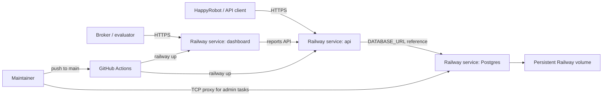

# Railway Deployment

Platform-wide deploy notes for `api`, `dashboard`, and `Postgres`. Dashboard-specific setup (metrics, Vite env, CORS, local dev) is in [dashboard.md](./dashboard.md).

## Live Deployment

This repository is designed to deploy into a Railway project with separate API, dashboard, and Postgres services. Keep environment-specific IDs and generated domains in Railway or GitHub secrets rather than committing them to the repository.

```text
project:      <railway-project-name>
project_id:   <railway-project-id>
environment:  production
api service:  api
db service:   Postgres
public API:   https://<api-service>.up.railway.app
health:       https://<api-service>.up.railway.app/health
```

Smoke-test deployments with `/health` and an authenticated `GET /api/reports/summary` request after migrations and seed data are applied.

## Deployment Architecture



The API is a Bun/Hono service built with `apps/api/Dockerfile` and Railway's root `railway.json`. Public traffic enters through a Railway-provided HTTPS domain. The API connects to Postgres through Railway's private service network by using the `DATABASE_URL=${{Postgres.DATABASE_URL}}` reference variable. Railway runs `bun run db:migrate && bun run db:seed` as a pre-deploy command, then starts the compiled server with `bun apps/api/dist/index.js`, so fresh demo deployments do not require separate database bootstrap commands.

Postgres is a Railway managed database template service with persistent storage. For one-time admin tasks such as migrations and seed data, use the Railway TCP proxy or run commands from a Railway shell.

## Services

Create three Railway services:

- `api` from this repository using `apps/api/Dockerfile` and the root `railway.json`.
- `dashboard` from this repository using `apps/web/Dockerfile` and `apps/web/railway.json`.
- `Postgres` from Railway's SSL-enabled Postgres template.

Set the API service variables:

```text
NODE_ENV=production
PORT=3000
DATABASE_URL=${{Postgres.DATABASE_URL}}
API_KEY=<random secret>
MCP_PATH_TOKEN=<random unguessable token>
PUBLIC_API_BASE_URL=https://<api-service>.up.railway.app
HAPPYROBOT_API_KEY=<server-only HappyRobot key>
HAPPYROBOT_CLUSTER=us
HAPPYROBOT_ENVIRONMENT=production
FMCSA_WEB_KEY=<optional FMCSA WebKey>
CORS_ORIGINS=https://<dashboard-service>.up.railway.app,http://localhost:5173,http://localhost:4173
```

Set the `dashboard` service variables. `API_BASE_URL` and `API_KEY` are runtime server variables used by the dashboard proxy; `VITE_CLIENT_NAME` is read at build time by Vite.

```text
NODE_ENV=production
PORT=8080
API_BASE_URL=https://<api-service>.up.railway.app
API_KEY=<same value as the API service API_KEY>
VITE_CLIENT_NAME=Acme Logistics
```

Railway provides HTTPS for the public service URLs, satisfying the challenge HTTPS requirement.

Do not commit generated values for `API_KEY`, `MCP_PATH_TOKEN`, `HAPPYROBOT_API_KEY`, `FMCSA_WEB_KEY`, or any Postgres credentials.

For the POC security assumptions around browser keys, MCP path tokens, FMCSA WebKey usage, Railway TCP proxy exposure, and Terraform state secrets, see [security-poc.md](./security-poc.md).

## GitHub Actions Deployment

Pushes to `main` deploy the `api` and `dashboard` services to Railway through `.github/workflows/railway-deploy.yml`.

Required GitHub repository secrets:

```text
RAILWAY_TOKEN=<Railway account or project token>
RAILWAY_PROJECT_ID=<Railway project ID>
```

The workflow:

1. Installs dependencies with Bun.
2. Runs API/web typechecks, tests, and builds.
3. Installs the Railway CLI.
4. Runs:
   ```bash
   railway up --project "$RAILWAY_PROJECT_ID" --environment production --service api --ci
   railway up --project "$RAILWAY_PROJECT_ID" --environment production --service dashboard --ci
   ```

Keep the Railway services named `api` and `dashboard`, or update the workflow deploy steps.

## Deploy Steps

1. Push to `main` to deploy the repository to Railway.
2. Add a Postgres service.
3. Wire `DATABASE_URL` to `${{Postgres.DATABASE_URL}}`.
4. Set the remaining variables above.
5. Confirm:
   ```bash
   curl https://<api-service>.up.railway.app/health
   ```
6. Register HappyRobot workflow/tools:
   ```bash
   bun run happyrobot:sync
   ```

## HappyRobot MCP URL

Use:

```text
https://<api-service>.up.railway.app/mcp/<MCP_PATH_TOKEN>
```

The token is embedded in the path because the local SDK reference documents MCP registration by URL only.

Runtime request logging redacts MCP path tokens as `/mcp/<redacted>`, but the full URL should still be treated as a secret and rotated if exposed.

## Infrastructure As Code

Terraform for recreating this architecture in another Railway workspace or project is in `infra/terraform`.

The Terraform stack manages:

- Railway project and production environment,
- `api` service sourced from this GitHub repository,
- `dashboard` service sourced from `apps/web/railway.json`,
- `Postgres` service from Railway's SSL-enabled Postgres image,
- persistent database volume,
- Postgres TCP proxy for bootstrap/admin tasks,
- Railway-provided domains for API and dashboard,
- generated API/MCP/Postgres secrets,
- API, dashboard, and database variable collections (including API `CORS_ORIGINS` for the dashboard URL).

Use Terraform for new environments. To adopt the current live CLI-created project, import the live project and services first, then inspect `terraform plan` carefully before applying.

The TCP proxy and local Terraform state are acceptable POC conveniences, not production defaults. Remove or restrict the TCP proxy after bootstrap, and use encrypted remote Terraform state before team-wide or production infrastructure management.

Relevant Railway references:

- Variables and reference syntax: https://docs.railway.com/variables/reference
- Railway domains and private networking: https://docs.railway.com/networking/domains/working-with-domains
- Railway Postgres: https://docs.railway.com/databases/postgresql
- Terraform provider: https://registry.terraform.io/providers/terraform-community-providers/railway/latest/docs

## Related Docs

- [dashboard.md](./dashboard.md) — operations dashboard UI
